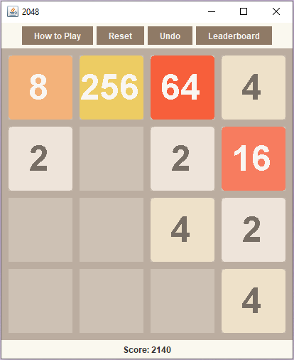

# 2048 Game
Last updated December 2020

Recreated web game 2048 with Java Swing. Includes added features of an unlimited Undo button and leaderboard. Incorporated concepts of 2D arrays, collections, file I/O.

Implementation: \\
**Tile.java** is the Tile class that represents each cell of the game board. As explained above, they contain number data and color data that corresponds to the number. 
**TwentyFourtyEight.java** is the main model of the game. It contains all the methods relating to shifting tiles and changing the game state.
**GameBoard.java** is sets up the game board and also does the visual painting after each move. The key presses are listened to there as well.
**Game.java** sets up the Swing components (JFrame, JPanel, JButtons etc) and also starts the game.

Original version created by Gabriele Cirulli (https://play2048.co/)

